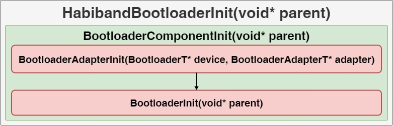
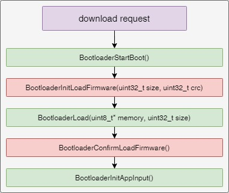
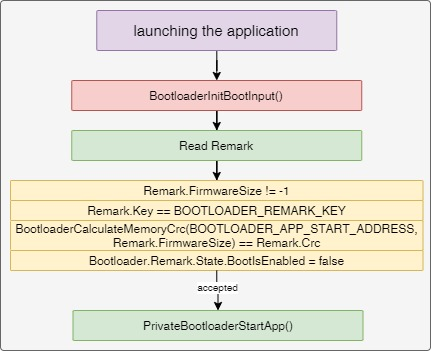
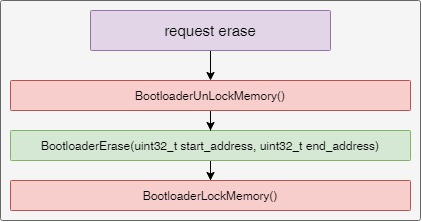
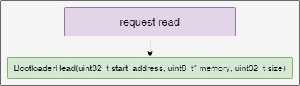
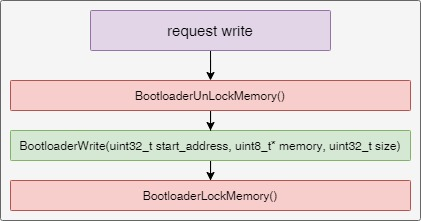

# Notes
___
## Content
- [Notes](#notes)
  - [Content](#content)
    - [Description](#description)
    - [Functional diagrams](#functional-diagrams)
    - [Parent](#parent)
    - [Folders](#folders)
    - [External dependencies](#external-dependencies)

### Description
- The component includes:
  - abstract level for managing low-level functions
  - memory management and system functions
  - supports downloading a firmware image
- Files:
  - [Bootloader_Types.h](Bootloader_Types.h) - contains defining types
  - [Bootloader_AdapterBase.h](Bootloader_AdapterBase.h) - abstract object, contains the basic interfaces necessary for the implementation of inheritors
  - [Bootloader_Config.h](Bootloader_Config.h) - contains default settings, constants, and other configurable values
  - [Bootloader_Component.с](Bootloader_Component.с) contains initialization and implementation of the necessary interfaces for the operation of the component
  - [Bootloader_Adapter.c](Adapters/Bootloader_Adapter.c) - contains a low-level adapter for hardware management functions, is the successor of BootloaderAdapterBaseT
  - [Bootloader_Control.c](Adapters/Bootloader_Control.c) - contains management functions, status updates, processing

### Functional diagrams
- Initialization

  

- Time synchronization

  

- Handler

  

- Downloading firmware

  

- Launching the application

  

- Erase

  

- Read

  

- Write

  

### Parent
- [Habiband](/Bootloader/Components/Habiband)

### Folders
- [Documents](Documents) - contains a diagrams, description of the component modules, etc.

### External dependencies
