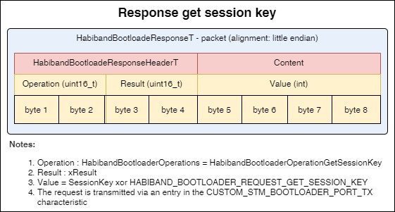
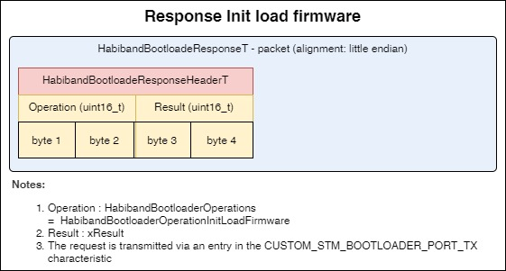

# Notes
___
## Content
- [Notes](#notes)
  - [Content](#content)
    - [Description](#description)
    - [Component diagrams](#component-diagrams)
    - [BLE logic diagrams](#ble-logic-diagrams)
    - [BLE Updates](#ble-updates)
    - [BLE Packets](#ble-packets)
    - [Folders](#folders)
    - [External dependencies](#external-dependencies)

### Description
- Implementation of Habiband firmware by BLE
- The component includes:
  - abstract level for managing low-level functions
  - status monitoring and management
  - working with BLE
  - processing of the included components
- Files:
  - [Habiband_BootloaderTypes.h](Habiband_BootloaderTypes.h) contains types
  - [Habiband_BootloaderConfig.h](Habiband_BootloaderConfig.h) - contains default settings, constants, and other configurable values
  - [Habiband_Bootloader.с](Habiband_Control.с) contains common logic and handlers
  - [Habiband_BootloaderRequestsReceiver.c](Habiband_BootloaderRequestsReceiver.c) contains a request handler for incoming BLE requests, a request parser

### Component diagrams
- Initialization:
  
  

- Inclusions:

  

- Handler:

  

### BLE logic diagrams
- Event listener:
  
  

- Requests receiver:
  
  
  
- Downloading the firmware:
  
  

### BLE Updates
- UpdateBootloaderStatus
  
  

- UpdateLoadingFirmware
  
  

### BLE Packets
___
- RequestGetSessionKey
  
  

- ResponseGetSessionKey
  
  
___
- RequestConfirmSessionKey
  
  

- ResponseConfirmSessionKey
  
  
___
- RequestStartBoot
  
  

- ResponseStartBoot
  
  
___
- RequestStartBoot
  
  

- ResponseStartBoot
  
  
___
- RequestInitLoadFirmware
  
  

- ResponseInitLoadFirmware
  
  
___
- RequestLoad
  
  

- ResponseLoad
  
  
___
- RequestConfirmationLoadFirmware
  
  

- ResponseConfirmationLoadFirmware
  
  
___
- RequestStartApp
  
  

- ResponseStartApp
  
  
___
- RequestCancelLoadFirmware
  
  

- ResponseCancelLoadFirmware
  
  
___
- RequestReset
  
  

- ResponseReset
  
  
___

### Folders
- [Documents](Documents) - contains a diagrams, description of the component modules, etc.

### External dependencies
- [Bootloader](/Bootloader/Components/Bootloader)
- [STM32_WPAN/App](/Bootloader/STM32_WPAN/App)
- [Core](/Bootloader/Core)
