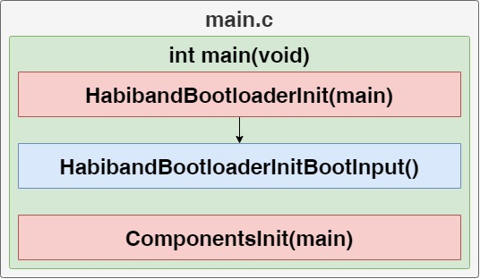

# Notes
___
## Content
- [Notes](#notes)
  - [Content](#content)
    - [Description](#description)
    - [Components](#components)
    - [Functional diograms](#functional-diograms)
    - [Folders](#folders)
    - [External dependencies](#external-dependencies)

### Description
- Contains a library of components and links the main functions
- Files:
  - [Components_Types.h](Components_Types.h) contains common types for all nested components and custom types
  - [Components_Config.h](Components_Config.h) contains default settings, constants, and other configurable values
  - [Components.c](Components.c) contains a set of functions for initializing and managing components

### Components
- [Bootloader](Bootloader) - contains a universal bootloader control layer
- [Habiband](Habiband) - contains a Habiband bootloader component

### Functional diograms
- Dependencies

  

- Initialization

  

- Time synchronization

  

- Handler

  

### Folders
- [Documents](Documents) - contains a diagrams, description of the component modules, etc.

### External dependencies
