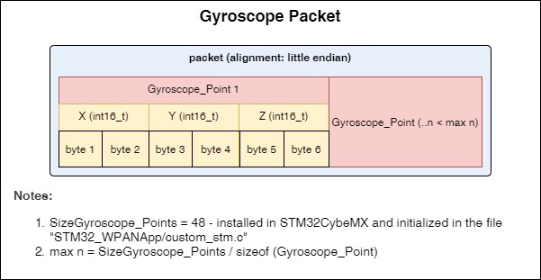

# Notes
___
## Content
- [Notes](#notes)
  - [Content](#content)
    - [Description](#description)
    - [Functional diagrams](#functional-diagrams)
    - [Description BLE](#description-ble)
    - [Folders](#folders)
    - [External dependencies](#external-dependencies)

### Description
- Smart bracelet that allow you to measure PG or ECG, have an accelerometer, gyroscope, temperature sensor, built-in backlight, BLE module
- The component includes:
  - abstract level for managing low-level functions
  - status monitoring and management
  - working with BLE
  - processing of the included components
  - settings management
- Files:
  - [Habiband_Types.h](Habiband_types.h) contains types
  - [Habiband_Config.h](Habiband_Config.h) - contains default settings, constants, and other configurable values
  - [Habiband_BLE.h](Habiband_BLE.h) contains data types for working with the BLE abstraction
  - [Habiband_BLEAdapter.с](Habiband_BLEAdapter.с) contains initialization of the BLE management interface
  - [Habiband_Control.с](Habiband_Control.с) contains common logic and handlers
  - [Habiband_Component.с](Habiband_Component.с) contains initialization and implementation of the necessary interfaces for the operation of the component

### Functional diagrams
- Initialization:
  
  

- Inclusions:

  

- Time synchronization:

  

- Handler:

  

### Description BLE
- Event handler:
  
  

- BLE Handler:
  
  
  
- PPG Packet:
  
  
  
- ECG Packet:
  
  
  
- Gyroscope Packet:
  
  
  
- Accelerometer Packet:
  
  

### Folders
- [Documents](Documents) - contains a diagrams, description of the component modules, etc.

### External dependencies
- [Components/ADP5360](/Components/ADP5360)
- [Components/AFE49I30](/Components/AFE49I30)
- [Components/LM2755](/Components/LM2755)
- [Components/LSM6DSOX](/Components/LSM6DSOX)
- [Components/MAX30208](/Components/MAX30208)
- [Bootloader/Components/Bootloader](/Bootloader/Components/Bootloader)
- [STM32_WPAN/App](/STM32_WPAN/App)
- [Core](/Core)
