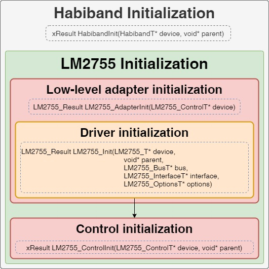
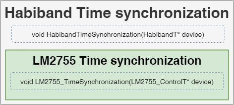
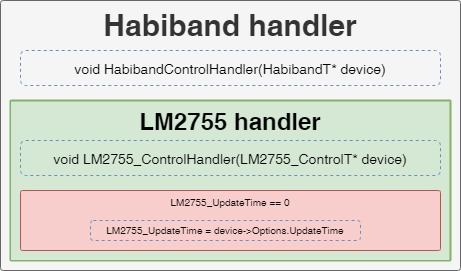

# Notes
___
## Content
- [Notes](#notes)
  - [Content](#content)
    - [Description](#description)
    - [Functional diagrams](#functional-diagrams)
    - [Folders](#folders)
    - [External dependencies](#external-dependencies)

### Description
- Backlight controller that allows you to control 3 lines of LEDs
- The component includes:
  - abstract level for managing low-level functions
  - status monitoring and management
  - settings management
- Files:
  - [LM2755_Types.h](LM2755_Types.h) - contains defining types
  - [LM2755_Config.h](LM2755_Config.h) - contains default settings, constants, and other configurable values
  - [LM2755_Adapter.c](LM2755_Adapter.c) - contains a low-level adapter for hardware management functions
  - [LM2755_Control.c](LM2755_Control.c) - contains management functions, status updates, processing

### Functional diagrams
- Initialization

  

- Time synchronization

  

- Handler

  

### Folders
- [Documents](Documents) - contains a diagrams, description of the component modules, etc.

### External dependencies
- [Libs/LM2755](/Libs/LM2755)
- [Core/Inc/main.h](/Core/Inc/main.h)
- [Core/Inc/i2c.h](/Core/Inc/i2c.h)