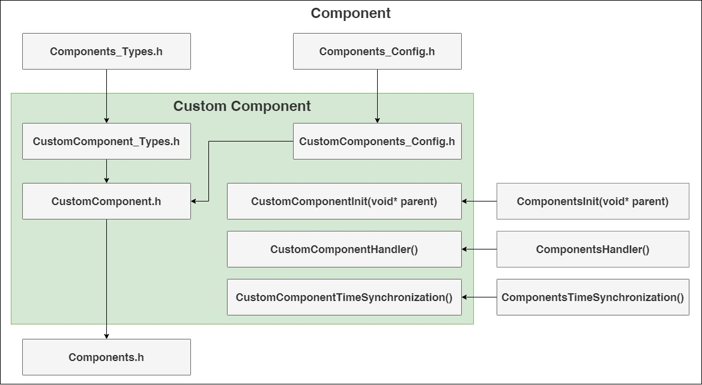
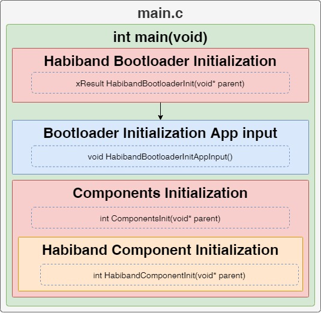
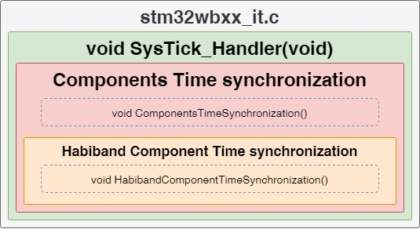
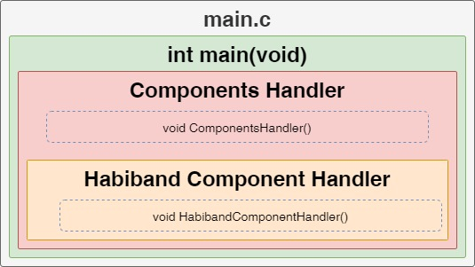

# Notes
___
## Content
- [Notes](#notes)
  - [Content](#content)
    - [Description](#description)
    - [Components](#components)
    - [Functional diagrams](#functional-diagrams)
    - [Folders](#folders)
    - [External dependencies](#external-dependencies)

### Description
- Contains a library of components and links the main functions
- Files:
  - [Components_Types.h](Components_Types.h) contains common types for all nested components and custom types
  - [Components_Config.h](Components_Config.h) contains default settings, constants, and other configurable values
  - [Components.c](Components.c) contains a set of functions for initializing and managing components

### Components
- [ADP5350](ADP5350) - Power controller
- [AFE49I30](AFE49I30) - PPG or ECG meters
- [DRV2605](DRV2605) - Haptic motor controller
- [Habiband](Habiband) - Smart bracelet that allow you to measure PPG or ECG, have an accelerometer, gyroscope, temperature sensor, built-in backlight, BLE module
- [LM2755](LM2755) - Backlight controller that allows you to control 3 lines of LEDs
- [LSM6DSOX](LSM6DSOX) - Gyroscope, accelerometer and temperature sensor
- [MAX30208](MAX30208) - Temperature sensor

### Functional diagrams
- Dependencies

  

- Initialization

  

- Time synchronization

  

- Handler

  

### Folders
- [Documents](Documents) - contains a diagrams, description of the component modules, etc.

### External dependencies
- [Bootloader](/Bootloader) - contains a bootloader project for habiband
