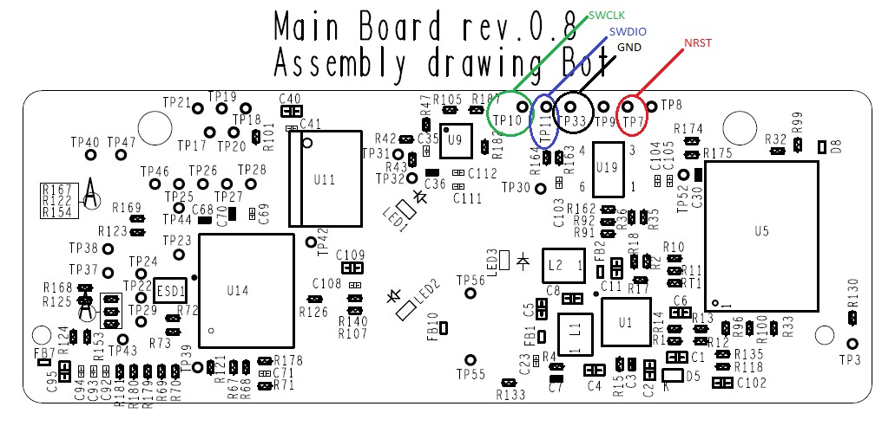
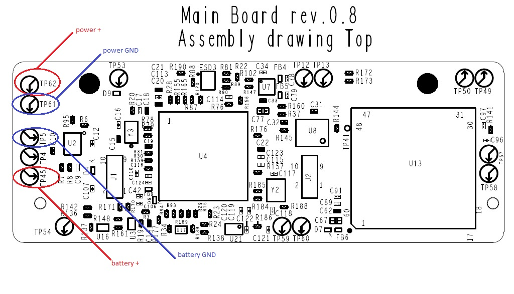
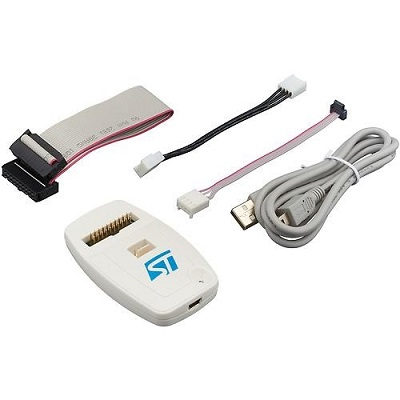
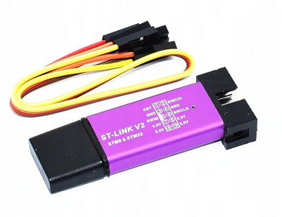

# device firmware description
___
### Content
1. [Required programmers](#required-programmers)
2. [Connecting the board](#connecting-the-board)
3. [Required software to download the firmware](#required-software-to-download-the-firmware)
4. [Firmware download procedure](#firmware-download-procedure)

### Connecting the board
  - connecting the SWD interface:
  
  
  
  - connecting power:
  
  
  
### Required software to download the firmware
  - [STM32CubeProgrammer](https://www.st.com/en/development-tools/stm32cubeprog.html)
  - [ST-LINK USB driver](https://www.st.com/en/development-tools/stsw-link009.html)
  
### Firmware download procedure
  - install the required [software](#required_software_to_download_the_firmware)
  - connect the programmer's SWD interface to the device and power
  - download the files [stm32wb5x_FUS_fw.bin](stm32wb5x_FUS_fw.bin) and [stm32wb5x_BLE_Stack_full_fw.bin](stm32wb5x_BLE_Stack_full_fw.bin) according to the [description](Release_Notes.html) from ST. The latest version of the documentation from the official ST [website](https://github.com/STMicroelectronics/STM32CubeWB/tree/master/Projects/STM32WB_Copro_Wireless_Binaries/STM32WB5x)
  - download the [habiband_boot.hex](habiband_boot.hex) using [STM32CubeProgrammer]()
  - download the [main program](habiband_test_blink_red.bin) using BLE

### Required programmers
  - STLink:
  
  
  
  - STLink V2 Mini:
  
  

